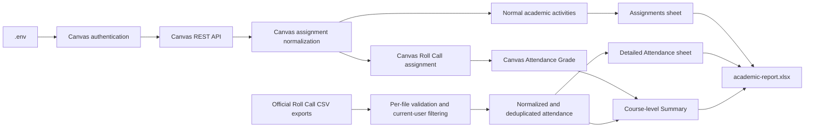

# Academic pipeline MVP

The academic pipeline writes one local Excel workbook from live Canvas assignments and detailed attendance sessions in official Roll Call exports.

The tested standard Canvas APIs expose Roll Call as an external-tool assignment with an aggregate grade, but not its individual class-date attendance sessions. Those detailed records therefore come from offline official Roll Call CSV exports. Each file is filtered to the current Canvas profile ID before normalization.

Normal academic activities and attendance remain separate because they represent different record types and granularities. Roll Call is identified from its Instructure external-tool/LTI metadata, not its editable assignment display name. It is excluded from the Assignments sheet and from all academic activity counts, while its exact Canvas grade appears only as Canvas Attendance Grade in Summary. Detailed attendance still comes from official offline Roll Call CSV exports.

The Assignments sheet displays Score, Points Possible, and Percentage, where Percentage is calculated as Score divided by Points Possible. Detailed Present, Absent, and Late records come only from offline Roll Call CSV exports. Courses without detailed offline attendance remain in Summary with blank attendance cells, even when Canvas provides an aggregate Roll Call grade.

Place one or more official CSV exports directly in `data/input/attendance/`. Exports may cover different courses and date ranges, and filenames do not determine course identity or priority. Overlapping events are deduplicated by Course ID, Section ID, and Class Date; the first record from deterministic filename order is retained. Missing rows are never interpreted as presence or absence.

Summary includes courses discovered through returned Canvas assignments. Courses with no returned assignments are not added solely for completeness in this MVP.

The raw exports contain private educational data and are ignored by Git, as is the generated report. Missing student/date rows are never interpreted as present or absent, and the pipeline does not fabricate attendance records or percentages.

## Local usage

1. Place official exports at `data/input/attendance/*.csv`.
2. Configure `.env` with `CANVAS_BASE_URL` and `CANVAS_ACCESS_TOKEN`.
3. Run `npm run academic:pipeline`.
4. Open `data/output/academic-report.xlsx`.
