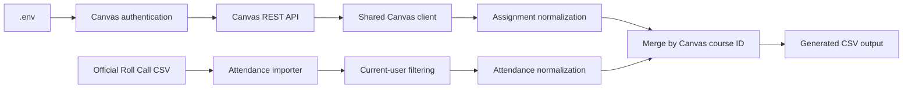

# Academic pipeline MVP

The academic pipeline combines live Canvas assignment data with the detailed attendance sessions in an official Roll Call export and writes one local CSV report.

The tested standard Canvas APIs expose Roll Call as an external-tool assignment with an aggregate grade, but not its individual class-date attendance sessions. Those detailed records therefore come from the offline official Roll Call CSV. The importer selects only rows matching the current Canvas profile ID before normalization and merging.

The raw export contains private educational data and is ignored by Git, as is the generated report. Missing student/date rows are never interpreted as present or absent, and the pipeline does not fabricate attendance records or percentages.

## Local usage

1. Place the official export at `data/input/attendance.csv`.
2. Configure `.env` with `CANVAS_BASE_URL` and `CANVAS_ACCESS_TOKEN`.
3. Run `npm run academic:pipeline`.
4. Read `data/output/academic-pipeline.csv`.
